# Chicago Crimes Ray-Sweeping Experiment (20251204_223121)

Loading Chicago Crimes dataset...
No --csv-path provided. Downloading Chicago Crimes dataset via kagglehub...
Using dataset file: C:\Users\james\.cache\kagglehub\datasets\currie32\crimes-in-chicago\versions\1\Chicago_Crimes_2012_to_2017.csv
Loaded dataset with shape: (510372, 27)
Primary point set shape: (500, 2)
Rotated point set shape: (500, 2)

Visualizing primary and rotated point sets...

================================================================================
COMPARISON: Original vs Updated Implementation
================================================================================

[ORIGINAL VERSION] Running on primary point set...
  Time: 7.7700 s, Found 5 directions
[ORIGINAL VERSION] Running on rotated point set...
  Time: 4.7247 s, Found 5 directions

[UPDATED VERSION] Running on primary point set...
  Time: 4.6031 s, Found 5 directions
[UPDATED VERSION] Running on rotated point set...
  Time: 2.6299 s, Found 5 directions

--------------------------------------------------------------------------------
COMPARISON RESULTS:
--------------------------------------------------------------------------------

Original Version (no min-shift, no vector_transfer):
  Best skew: 0.267657
  Direction: (0.999979, 0.006469)
  Total time: 12.4947 s

Updated Version (with min-shift and vector_transfer):
  Best skew: 0.267657
  Direction: (-0.006469, 0.999979)
  Total time: 7.2330 s

Differences:
  Skew difference: 0.000000
  Direction difference (L2 norm): 1.414214
  Time difference: -5.2617 s

Top-3 directions comparison:

**Original Version:**
| Rank | Direction (x, y) | Skew |
|------|------------------|------|
| 1 | (0.999979, 0.006469) | 0.267657 |
| 2 | (0.948140, 0.317854) | 0.216177 |
| 3 | (0.806782, 0.590850) | 0.130762 |

**Updated Version:**
| Rank | Direction (x, y) | Skew |
|------|------------------|------|
| 1 | (-0.006469, 0.999979) | 0.267657 |
| 2 | (-0.317854, 0.948140) | 0.216177 |
| 3 | (0.806782, 0.590850) | 0.130762 |
================================================================================

Visualizing top-3 directions for ORIGINAL VERSION (on primary set)...

[Original] Visualizing tail along top-1 direction...

Using reimplemented top direction for visualization.

Validation: skew along chosen direction f is -0.058959
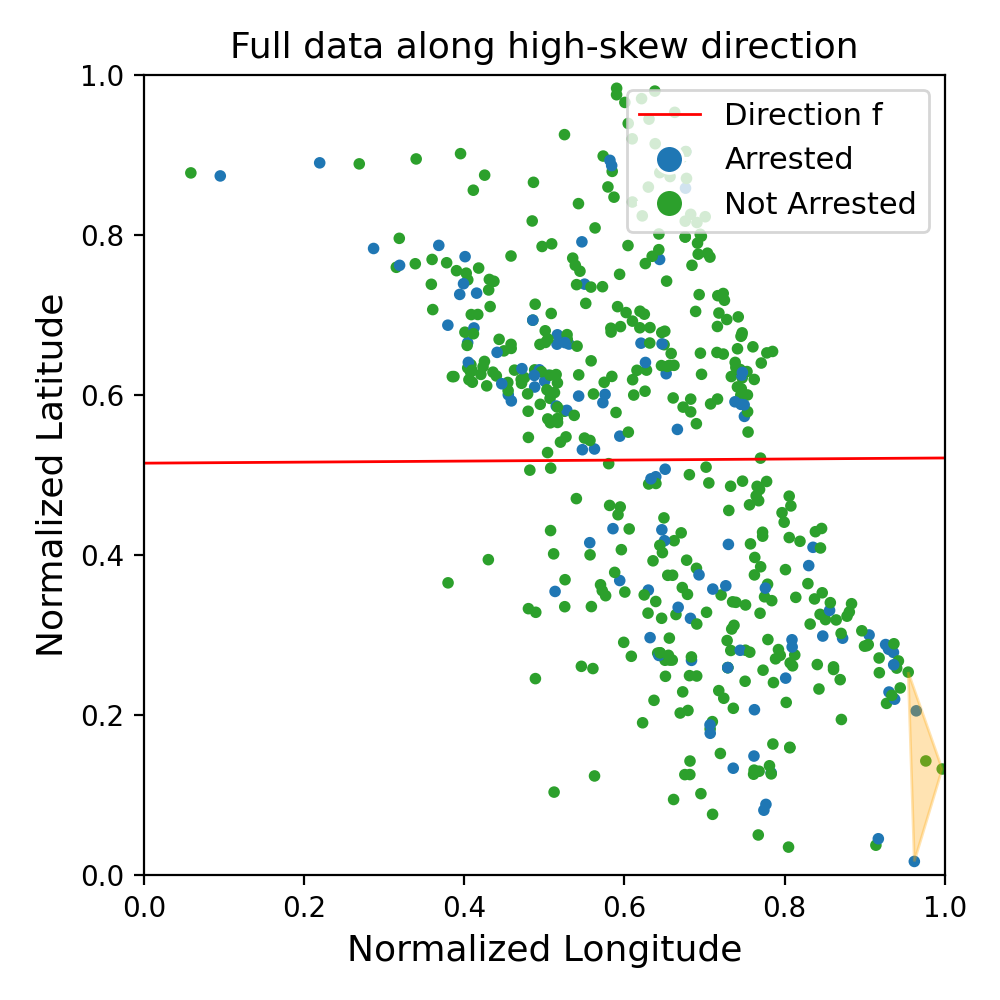
Tail subset shape (q=0.01): (5104, 27)
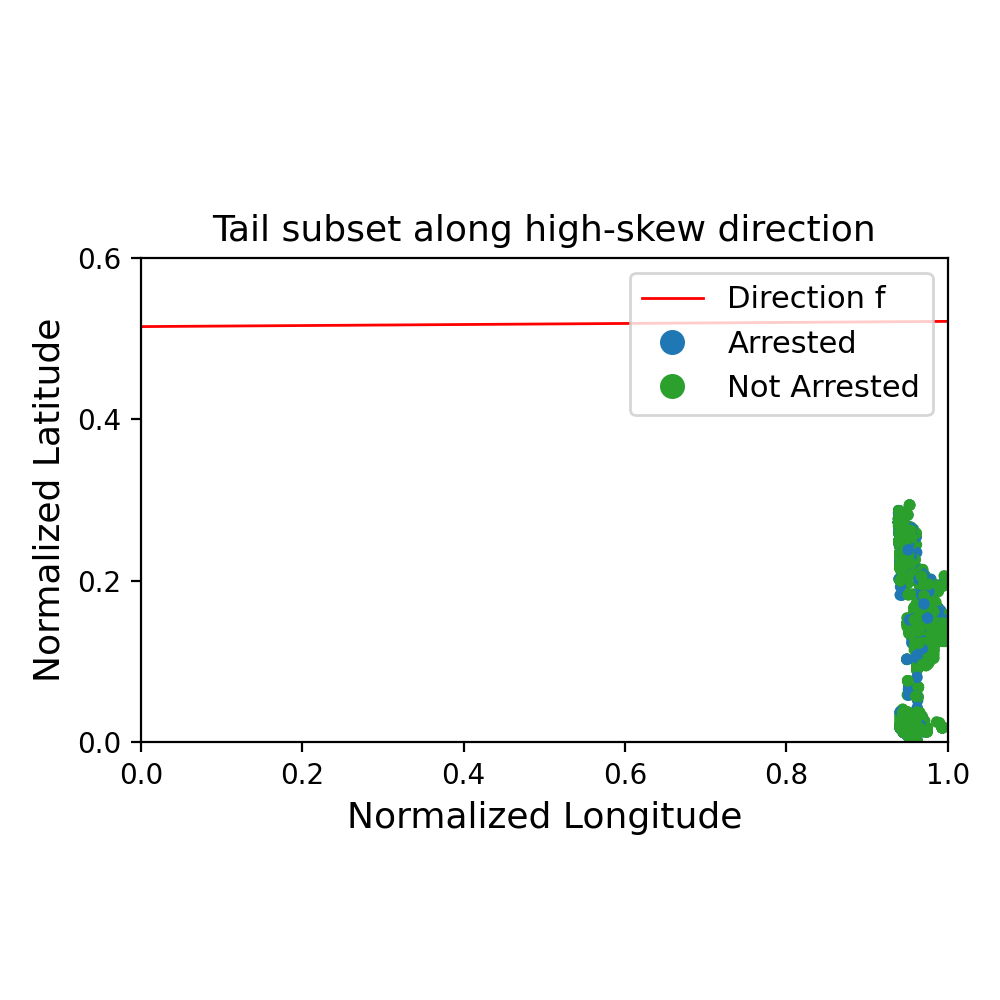
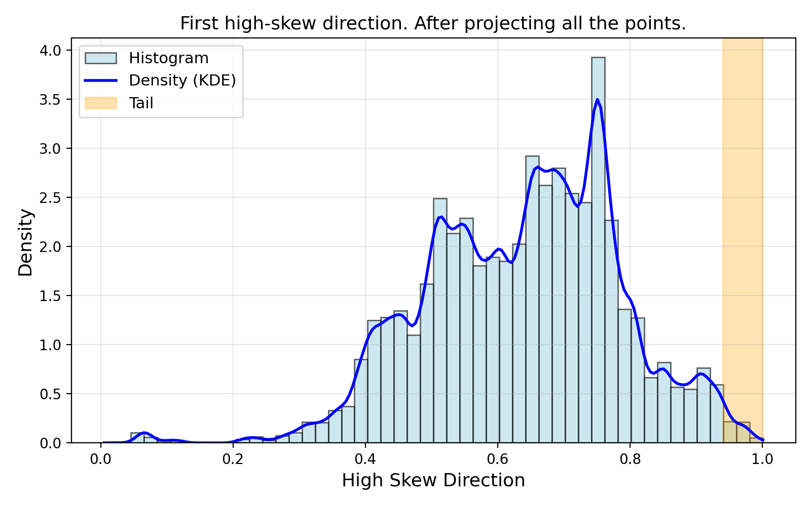

=== Global vs Tail statistics (Chicago Crimes) ===
| Metric                             | Global | Tail |
|------------------------------------|:------:|:----:|
| Positive rate (Arrest=1)          | 0.228 | 0.214 |
| Accuracy (Logistic Regression)    | 0.799 | 0.788 |
| F1 (Logistic Regression)          | 0.330 | 0.216 |

=== Multi-Percentile Evaluation Table (Chicago Crimes, full dataset) ===
| Percentile | PosRate_tail | Accuracy | F1-score |
|-----------:|-------------:|---------:|---------:|
|    1.00000 |       0.228 |    0.799 |    0.330 |
|    0.10000 |       0.214 |    0.796 |    0.228 |
|    0.01000 |       0.214 |    0.788 |    0.216 |
|    0.00100 |       0.170 |    0.810 |    0.198 |
|    0.00010 |       0.255 |    0.745 |    0.250 |

[Original] Visualizing tail along top-2 direction...

Using reimplemented top direction for visualization.

Validation: skew along chosen direction f is -0.011863
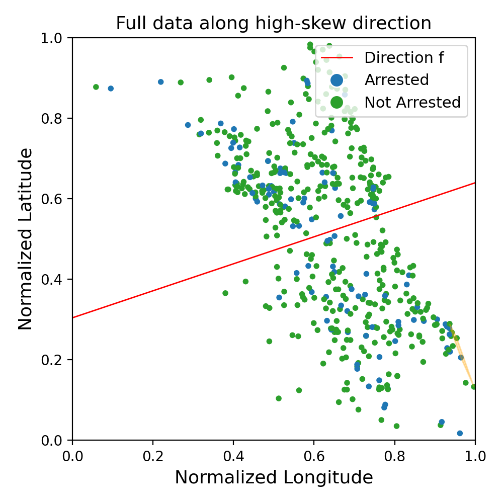
Tail subset shape (q=0.01): (5103, 27)
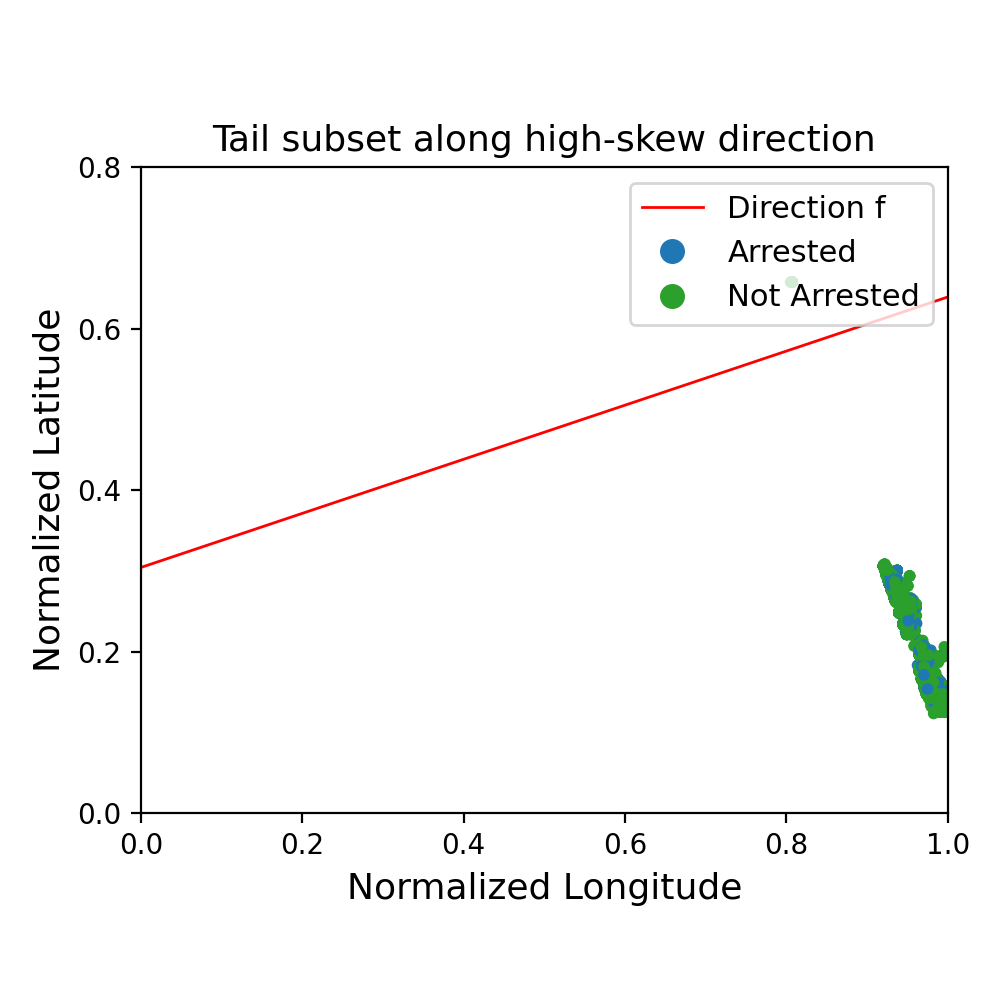
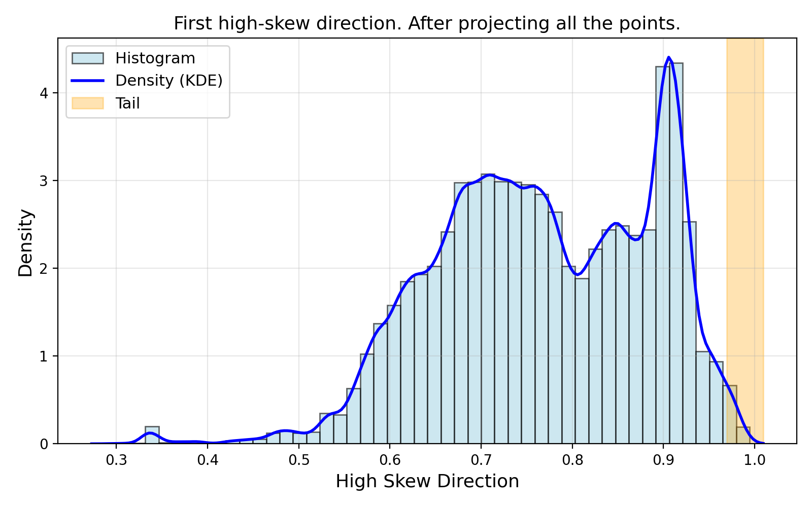

=== Global vs Tail statistics (Chicago Crimes) ===
| Metric                             | Global | Tail |
|------------------------------------|:------:|:----:|
| Positive rate (Arrest=1)          | 0.228 | 0.252 |
| Accuracy (Logistic Regression)    | 0.799 | 0.761 |
| F1 (Logistic Regression)          | 0.330 | 0.240 |

=== Multi-Percentile Evaluation Table (Chicago Crimes, full dataset) ===
| Percentile | PosRate_tail | Accuracy | F1-score |
|-----------:|-------------:|---------:|---------:|
|    1.00000 |       0.228 |    0.799 |    0.330 |
|    0.10000 |       0.202 |    0.807 |    0.205 |
|    0.01000 |       0.252 |    0.761 |    0.240 |
|    0.00100 |       0.236 |    0.768 |    0.224 |
|    0.00010 |       0.277 |    0.745 |    0.400 |

[Original] Visualizing tail along top-3 direction...

Using reimplemented top direction for visualization.

Validation: skew along chosen direction f is 0.131825
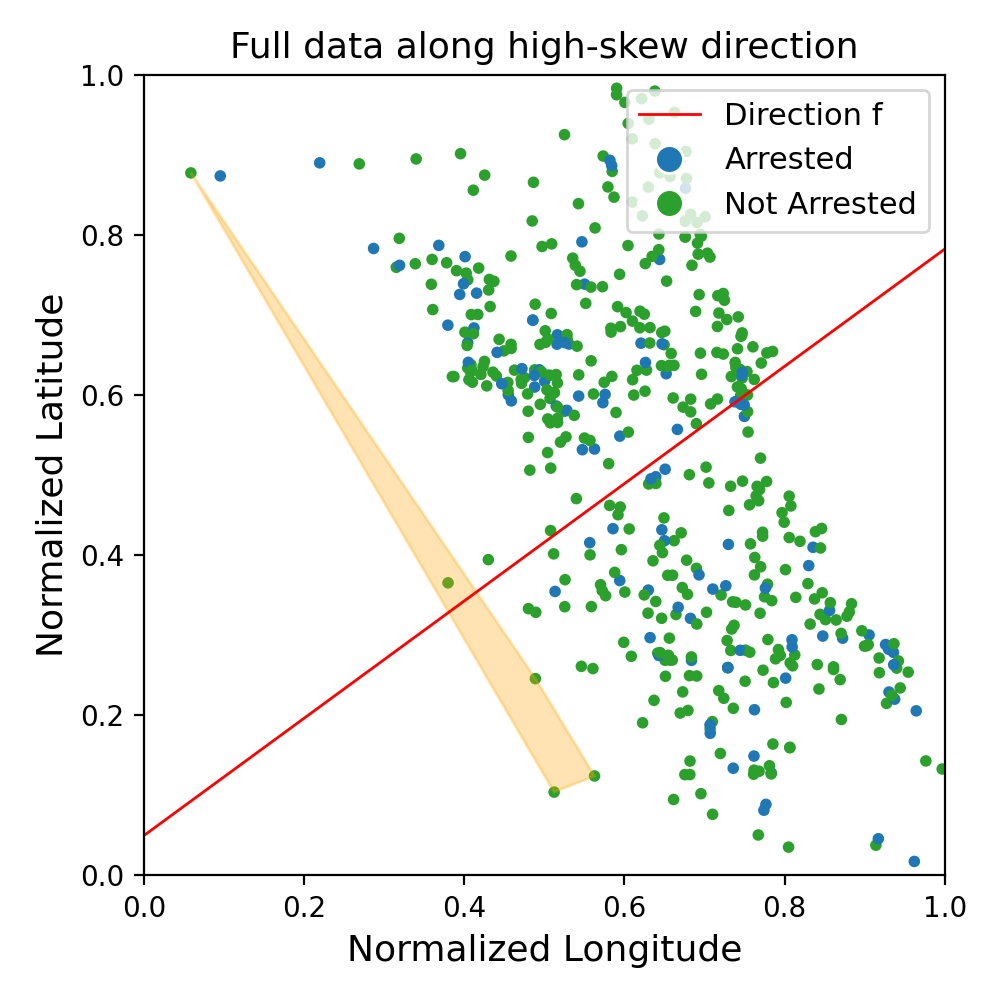
Tail subset shape (q=0.01): (5097, 27)

=== Global vs Tail statistics (Chicago Crimes) ===
| Metric                             | Global | Tail |
|------------------------------------|:------:|:----:|
| Positive rate (Arrest=1)          | 0.228 | 0.205 |
| Accuracy (Logistic Regression)    | 0.799 | 0.790 |
| F1 (Logistic Regression)          | 0.330 | 0.231 |

=== Multi-Percentile Evaluation Table (Chicago Crimes, full dataset) ===
| Percentile | PosRate_tail | Accuracy | F1-score |
|-----------:|-------------:|---------:|---------:|
|    1.00000 |       0.228 |    0.799 |    0.330 |
|    0.10000 |       0.199 |    0.811 |    0.330 |
|    0.01000 |       0.205 |    0.790 |    0.231 |
|    0.00100 |       0.116 |    0.870 |    0.327 |
|    0.00010 |       0.058 |    0.865 |    0.000 |

Visualizing top-3 directions for UPDATED VERSION (on primary set)...

[Updated] Visualizing tail along top-1 direction...

Using reimplemented top direction for visualization.

Validation: skew along chosen direction f is -0.267657
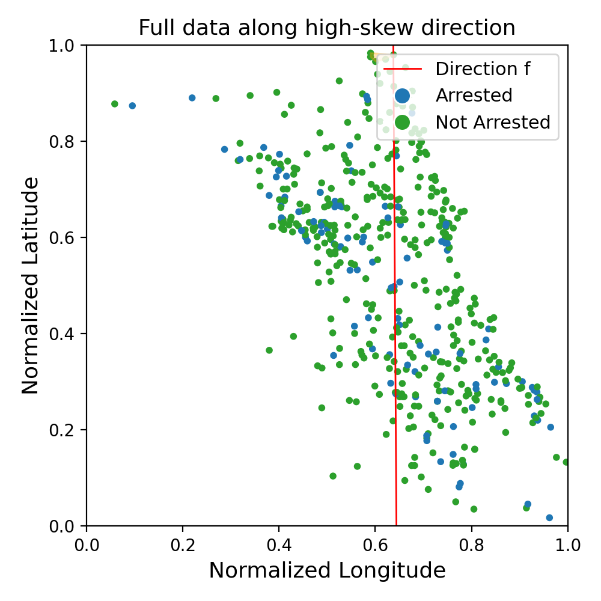
Tail subset shape (q=0.01): (5104, 27)

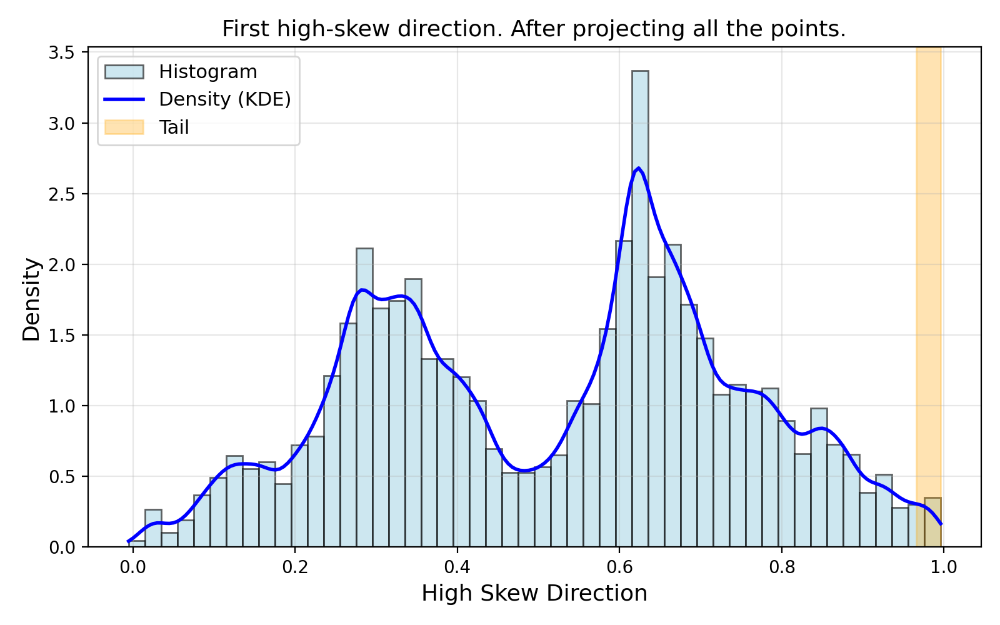

=== Global vs Tail statistics (Chicago Crimes) ===
| Metric                             | Global | Tail |
|------------------------------------|:------:|:----:|
| Positive rate (Arrest=1)          | 0.228 | 0.203 |
| Accuracy (Logistic Regression)    | 0.799 | 0.801 |
| F1 (Logistic Regression)          | 0.330 | 0.146 |

=== Multi-Percentile Evaluation Table (Chicago Crimes, full dataset) ===
| Percentile | PosRate_tail | Accuracy | F1-score |
|-----------:|-------------:|---------:|---------:|
|    1.00000 |       0.228 |    0.799 |    0.330 |
|    0.10000 |       0.180 |    0.824 |    0.230 |
|    0.01000 |       0.203 |    0.801 |    0.146 |
|    0.00100 |       0.226 |    0.787 |    0.260 |
|    0.00010 |       0.154 |    0.846 |    0.000 |

[Updated] Visualizing tail along top-2 direction...

Using reimplemented top direction for visualization.

Validation: skew along chosen direction f is -0.216177
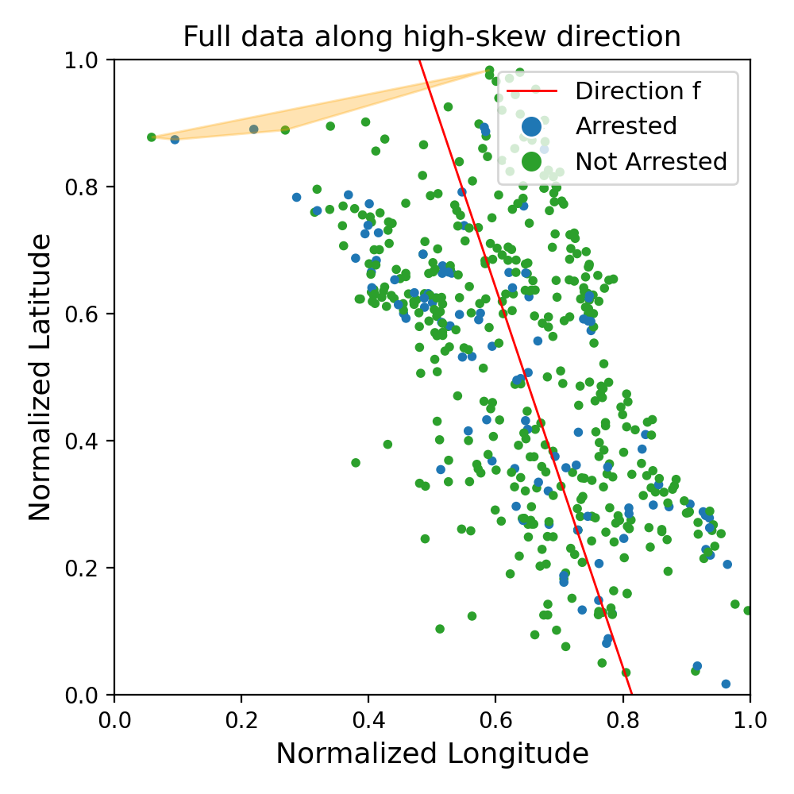
Tail subset shape (q=0.01): (5104, 27)

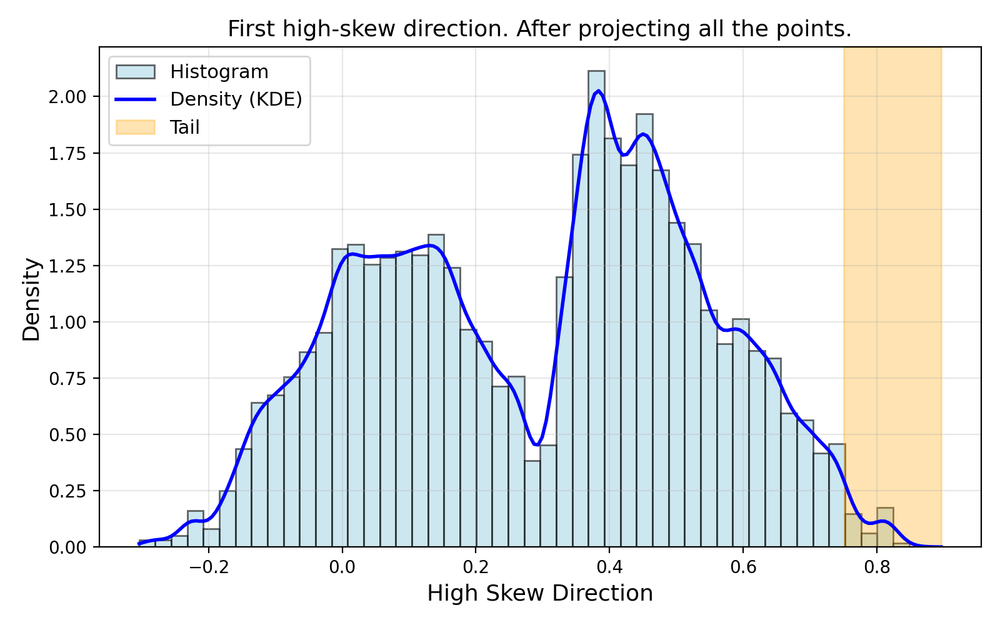

=== Global vs Tail statistics (Chicago Crimes) ===
| Metric                             | Global | Tail |
|------------------------------------|:------:|:----:|
| Positive rate (Arrest=1)          | 0.228 | 0.188 |
| Accuracy (Logistic Regression)    | 0.799 | 0.840 |
| F1 (Logistic Regression)          | 0.330 | 0.510 |

=== Multi-Percentile Evaluation Table (Chicago Crimes, full dataset) ===
| Percentile | PosRate_tail | Accuracy | F1-score |
|-----------:|-------------:|---------:|---------:|
|    1.00000 |       0.228 |    0.799 |    0.330 |
|    0.10000 |       0.171 |    0.832 |    0.239 |
|    0.01000 |       0.188 |    0.840 |    0.510 |
|    0.00100 |       0.134 |    0.844 |    0.290 |
|    0.00010 |       0.019 |    0.904 |    0.000 |

[Updated] Visualizing tail along top-3 direction...

Using reimplemented top direction for visualization.

Validation: skew along chosen direction f is 0.131825

Tail subset shape (q=0.01): (5097, 27)
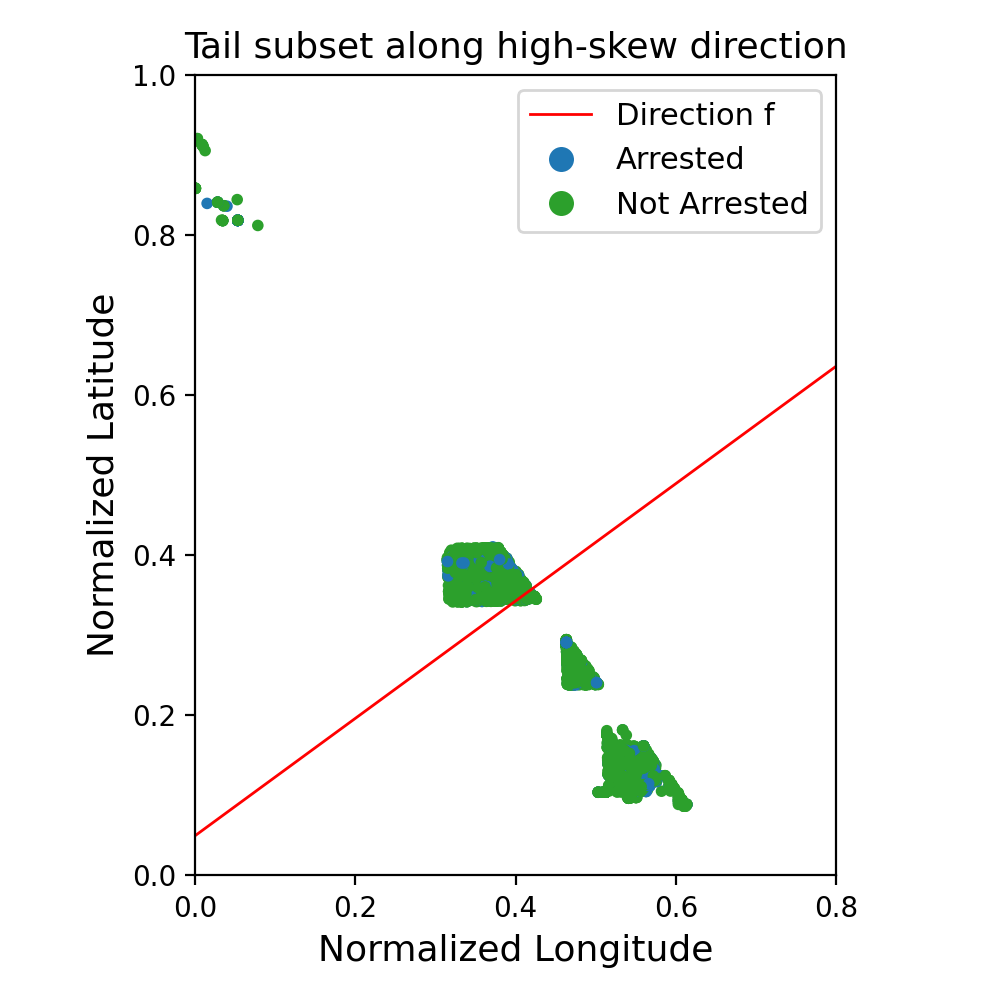
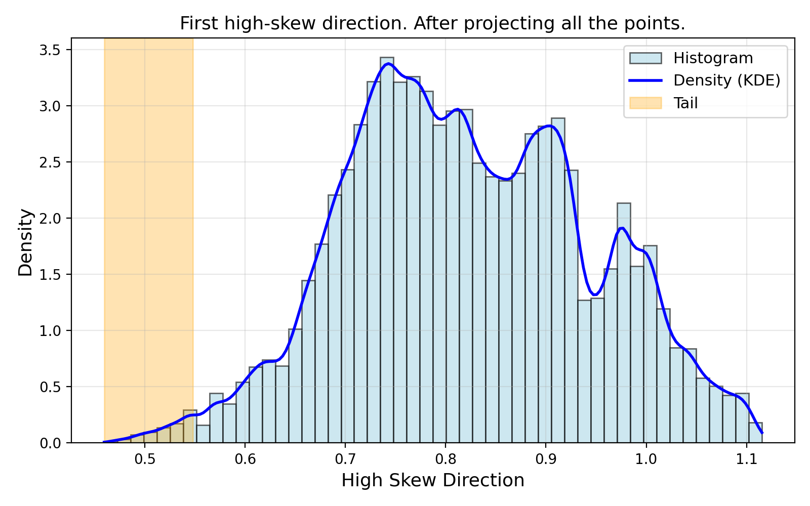

=== Global vs Tail statistics (Chicago Crimes) ===
| Metric                             | Global | Tail |
|------------------------------------|:------:|:----:|
| Positive rate (Arrest=1)          | 0.228 | 0.205 |
| Accuracy (Logistic Regression)    | 0.799 | 0.790 |
| F1 (Logistic Regression)          | 0.330 | 0.231 |

=== Multi-Percentile Evaluation Table (Chicago Crimes, full dataset) ===
| Percentile | PosRate_tail | Accuracy | F1-score |
|-----------:|-------------:|---------:|---------:|
|    1.00000 |       0.228 |    0.799 |    0.330 |
|    0.10000 |       0.199 |    0.811 |    0.330 |
|    0.01000 |       0.205 |    0.790 |    0.231 |
|    0.00100 |       0.116 |    0.870 |    0.327 |
|    0.00010 |       0.058 |    0.865 |    0.000 |
