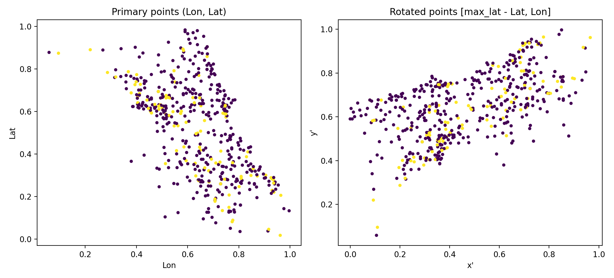
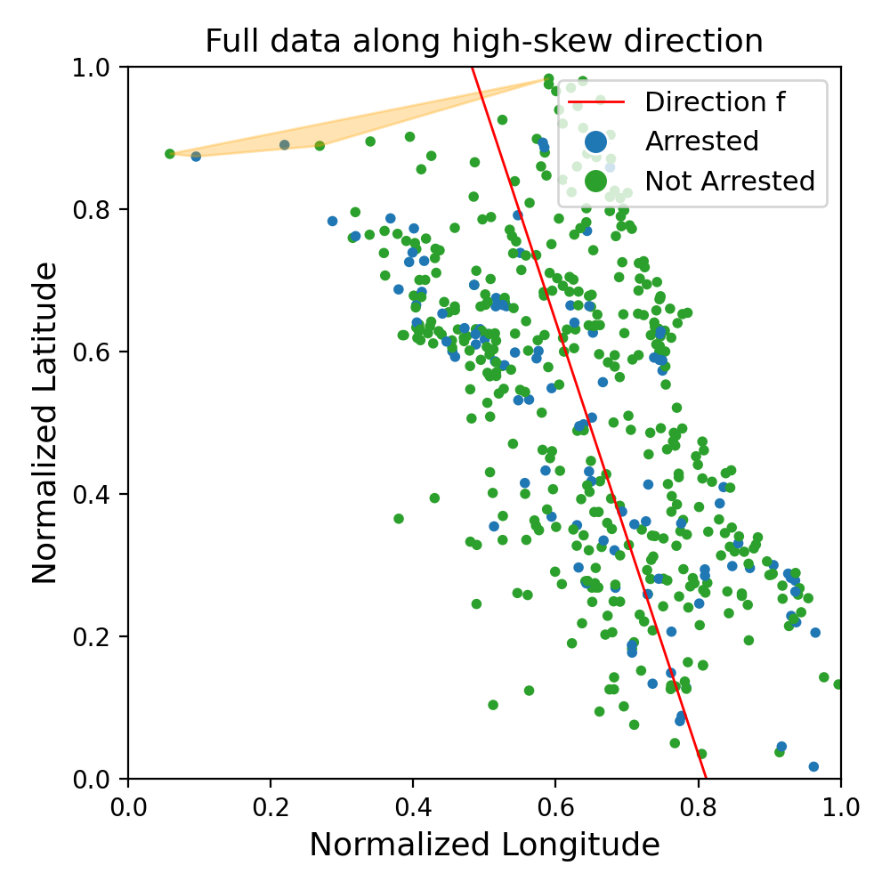
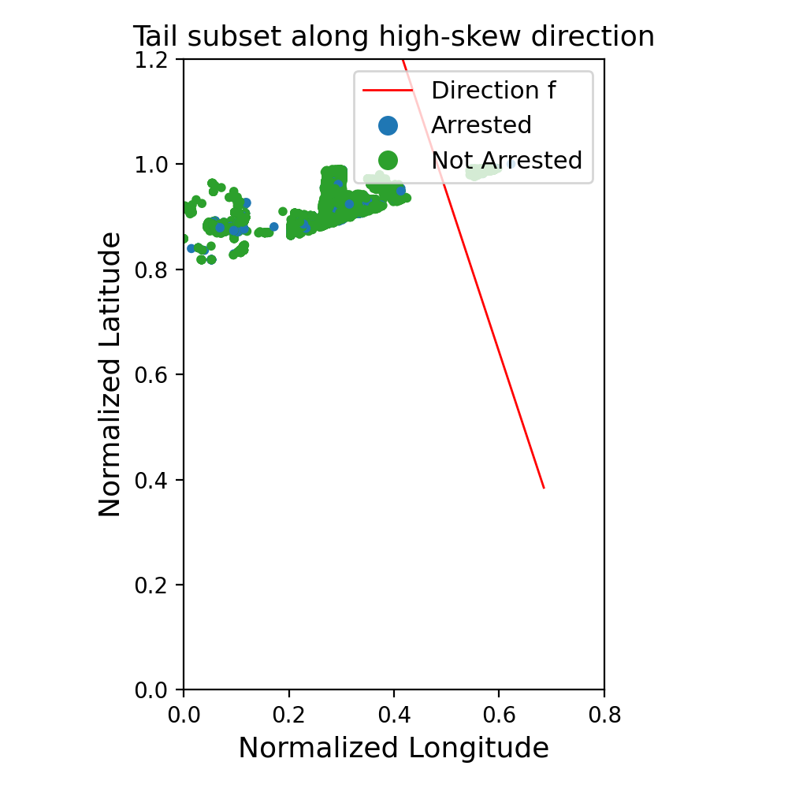
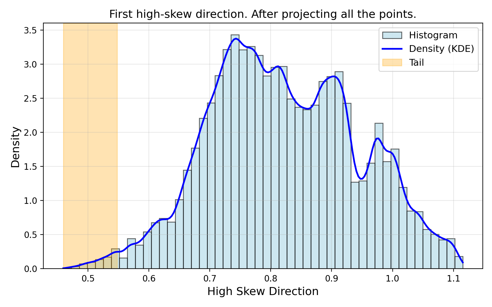
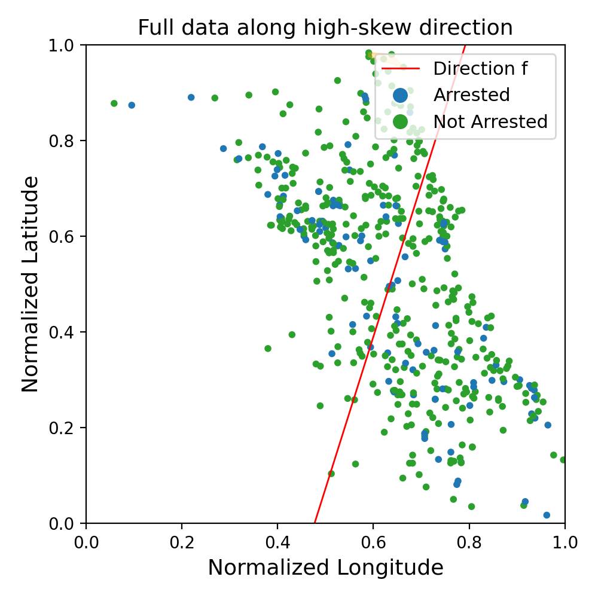
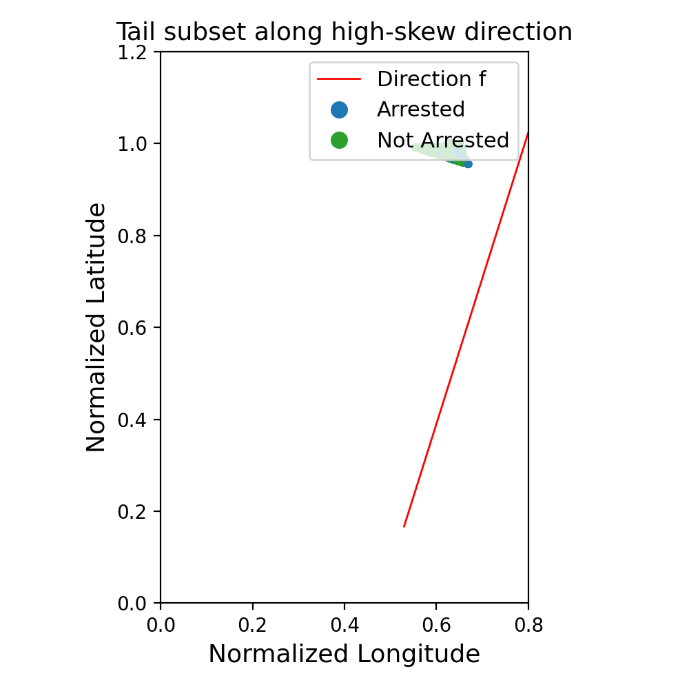
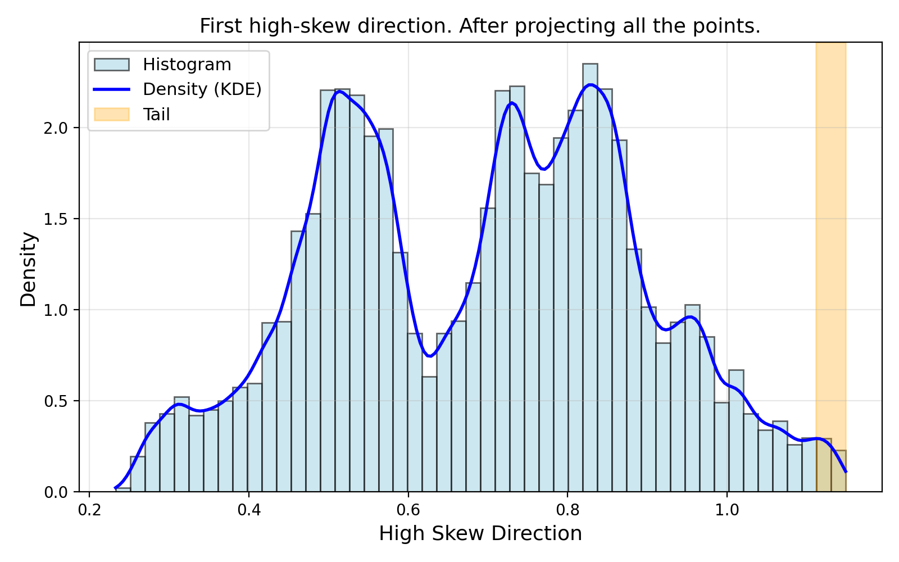

# Chicago Crimes Official-Utils Experiment (20251204_220522)

Loading Chicago Crimes dataset (official utils experiment)...
No --csv-path provided. Downloading Chicago Crimes dataset via kagglehub...
Using dataset file: C:\Users\james\.cache\kagglehub\datasets\currie32\crimes-in-chicago\versions\1\Chicago_Crimes_2012_to_2017.csv
Loaded dataset with shape: (510372, 27)
Primary point set shape: (500, 2)
Rotated point set shape: (500, 2)

Visualizing primary and rotated point sets (official utils)...

Running MaxSkewCalculator (official utils) on primary & rotated sets...
Number of intersects: 123072
Number of intersects: 123187
Reached Y axis, finish.
Reached Y axis, finish.
Total time (official utils): 20.0726 s

Top-k high-skew directions (official utils on rotated set):
| Rank | Direction (x, y) | Skew |
|------|------------------|------|
| 1 | (-0.247820, 0.752180) | -0.213581 |
| 2 | (0.577249, 0.422751) | -0.130762 |
| 3 | (0.239734, 0.760266) | -0.122260 |
| 4 | (-0.429774, 0.570226) | -0.112964 |
| 5 | (0.418711, 0.581289) | -0.090222 |
| 6 | (-0.778520, 0.221480) | -0.029925 |
| 7 | (0.752520, 0.247480) | -0.025112 |
| 8 | (-0.597339, 0.402661) | -0.023162 |

[Official utils] Visualizing tail and density along top-1 direction (skew=-0.213581)...

Using reimplemented top direction for visualization.

Validation: skew along chosen direction f is -0.215512

Tail subset shape (q=0.01): (5104, 27)

=== Global vs Tail statistics (Chicago Crimes) ===
| Metric                             | Global | Tail |
|------------------------------------|:------:|:----:|
| Positive rate (Arrest=1)          | 0.228 | 0.187 |
| Accuracy (Logistic Regression)    | 0.799 | 0.841 |
| F1 (Logistic Regression)          | 0.330 | 0.511 |

=== Multi-Percentile Evaluation Table (Chicago Crimes, full dataset) ===
| Percentile | PosRate_tail | Accuracy | F1-score |
|-----------:|-------------:|---------:|---------:|
|    1.00000 |       0.228 |    0.799 |    0.330 |
|    0.10000 |       0.171 |    0.832 |    0.239 |
|    0.01000 |       0.187 |    0.841 |    0.511 |
|    0.00100 |       0.138 |    0.841 |    0.274 |
|    0.00010 |       0.019 |    0.904 |    0.000 |

[Official utils] Visualizing tail and density along top-2 direction (skew=-0.130762)...

Using reimplemented top direction for visualization.

Validation: skew along chosen direction f is 0.131826

Tail subset shape (q=0.01): (5097, 27)

=== Global vs Tail statistics (Chicago Crimes) ===
| Metric                             | Global | Tail |
|------------------------------------|:------:|:----:|
| Positive rate (Arrest=1)          | 0.228 | 0.205 |
| Accuracy (Logistic Regression)    | 0.799 | 0.790 |
| F1 (Logistic Regression)          | 0.330 | 0.231 |

=== Multi-Percentile Evaluation Table (Chicago Crimes, full dataset) ===
| Percentile | PosRate_tail | Accuracy | F1-score |
|-----------:|-------------:|---------:|---------:|
|    1.00000 |       0.228 |    0.799 |    0.330 |
|    0.10000 |       0.199 |    0.811 |    0.330 |
|    0.01000 |       0.205 |    0.790 |    0.231 |
|    0.00100 |       0.116 |    0.870 |    0.327 |
|    0.00010 |       0.058 |    0.865 |    0.000 |

[Official utils] Visualizing tail and density along top-3 direction (skew=-0.122260)...

Using reimplemented top direction for visualization.

Validation: skew along chosen direction f is -0.121754

Tail subset shape (q=0.01): (5104, 27)

=== Global vs Tail statistics (Chicago Crimes) ===
| Metric                             | Global | Tail |
|------------------------------------|:------:|:----:|
| Positive rate (Arrest=1)          | 0.228 | 0.213 |
| Accuracy (Logistic Regression)    | 0.799 | 0.793 |
| F1 (Logistic Regression)          | 0.330 | 0.151 |

=== Multi-Percentile Evaluation Table (Chicago Crimes, full dataset) ===
| Percentile | PosRate_tail | Accuracy | F1-score |
|-----------:|-------------:|---------:|---------:|
|    1.00000 |       0.228 |    0.799 |    0.330 |
|    0.10000 |       0.178 |    0.824 |    0.175 |
|    0.01000 |       0.213 |    0.793 |    0.151 |
|    0.00100 |       0.229 |    0.784 |    0.225 |
|    0.00010 |       0.196 |    0.848 |    0.462 |
