# College Admission Ray-Sweeping Experiment (20251204_201425)

Loading College Admission dataset...
No --excel-path provided. Downloading College Admission dataset via kagglehub...
Using dataset file: C:\Users\james\.cache\kagglehub\datasets\eswarchandt\admission\versions\1\Admission.xlsx
Loaded dataset with shape: (400, 7)
Primary point set shape: (400, 2)
Rotated point set shape: (400, 2)

Visualizing primary and rotated point sets...

================================================================================
COMPARISON: Original vs Updated Implementation
================================================================================

[ORIGINAL VERSION] Running on primary point set...
  Time: 2.0383 s, Found 6 directions
[ORIGINAL VERSION] Running on rotated point set...
  Time: 1.7200 s, Found 7 directions

[UPDATED VERSION] Running on primary point set...
  Time: 1.1134 s, Found 5 directions
[UPDATED VERSION] Running on rotated point set...
  Time: 1.3393 s, Found 5 directions

--------------------------------------------------------------------------------
COMPARISON RESULTS:
--------------------------------------------------------------------------------

Original Version (no min-shift, no vector_transfer):
  Best skew: 0.185087
  Direction: (0.554700, 0.832050)
  Total time: 3.7583 s

Updated Version (with min-shift and vector_transfer):
  Best skew: 0.054339
  Direction: (-0.961524, 0.274721)
  Total time: 2.4526 s

Differences:
  Skew difference: 0.130748
  Direction difference (L2 norm): 1.615411
  Time difference: -1.3057 s

Top-3 directions comparison:

**Original Version:**
| Rank | Direction (x, y) | Skew |
|------|------------------|------|
| 1 | (0.554700, 0.832050) | 0.185087 |
| 2 | (-0.047565, 0.998868) | 0.172467 |
| 3 | (0.267644, 0.963518) | 0.147718 |

**Updated Version:**
| Rank | Direction (x, y) | Skew |
|------|------------------|------|
| 1 | (-0.961524, 0.274721) | 0.054339 |
| 2 | (-0.611052, 0.791590) | 0.049722 |
| 3 | (0.234054, 0.972224) | 0.042181 |
================================================================================

Visualizing top-3 directions for ORIGINAL VERSION (on primary set)...

[Original] Visualizing tail along top-1 direction...

Using reimplemented top direction for visualization.

Validation: skew along chosen direction f is -0.009128
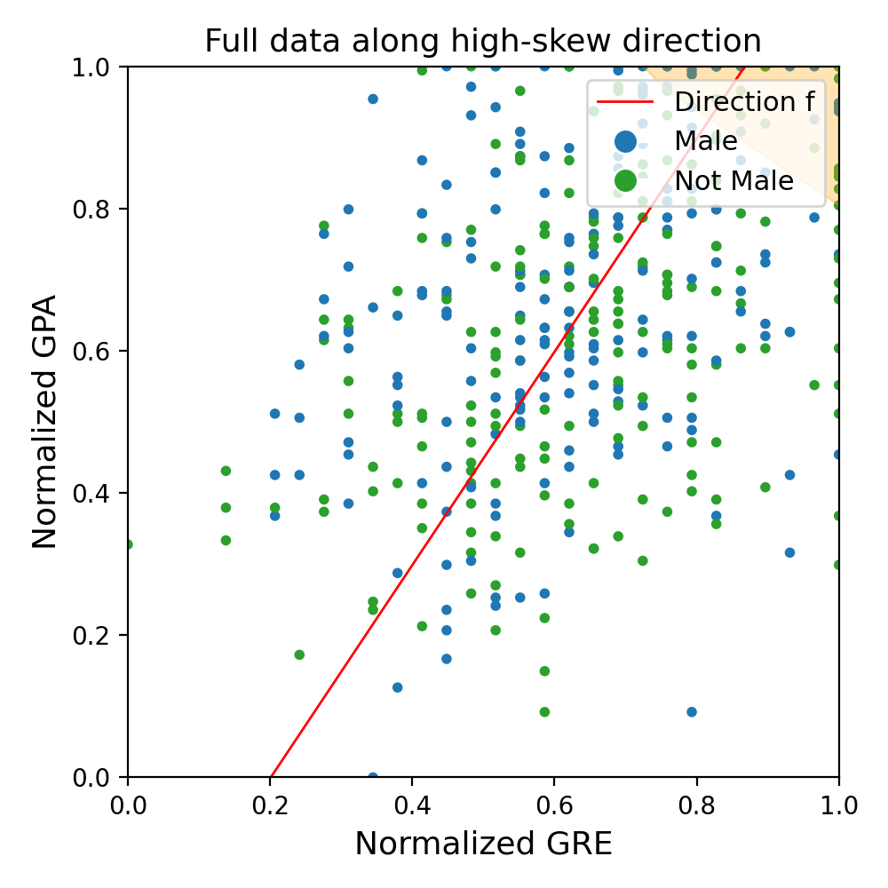
Tail subset shape (q=0.1): (39, 7)

=== Global vs Tail statistics (College Admission) ===
| Metric                             | Global | Tail |
|------------------------------------|:------:|:----:|
| Positive rate (admit=1)           | 0.318 | 0.436 |
| Accuracy (Logistic Regression)    | 0.713 | 0.590 |
| F1 (Logistic Regression)          | 0.320 | 0.529 |

=== Multi-Percentile Evaluation Table ===
| Percentile | Accuracy | F1-score | F/M ratio |
|-----------:|---------:|---------:|----------:|
|       1.00 |    0.712 |    0.320 |    1.111 |
|       0.50 |    0.638 |    0.400 |    1.236 |
|       0.20 |    0.650 |    0.517 |    0.951 |
|       0.10 |    0.590 |    0.529 |    0.696 |
|       0.08 |    0.562 |    0.500 |    0.882 |
|       0.04 |    0.533 |    0.462 |    1.500 |
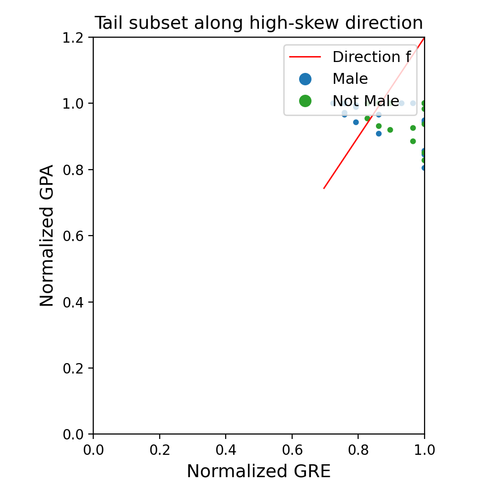
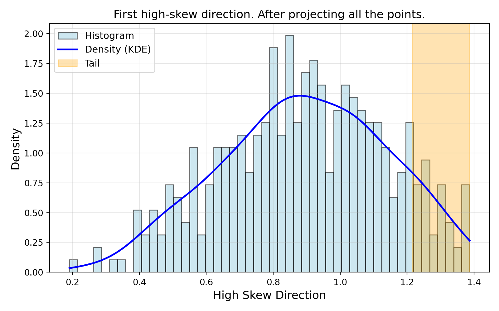

[Original] Visualizing tail along top-2 direction...

Using reimplemented top direction for visualization.

Validation: skew along chosen direction f is -0.028032
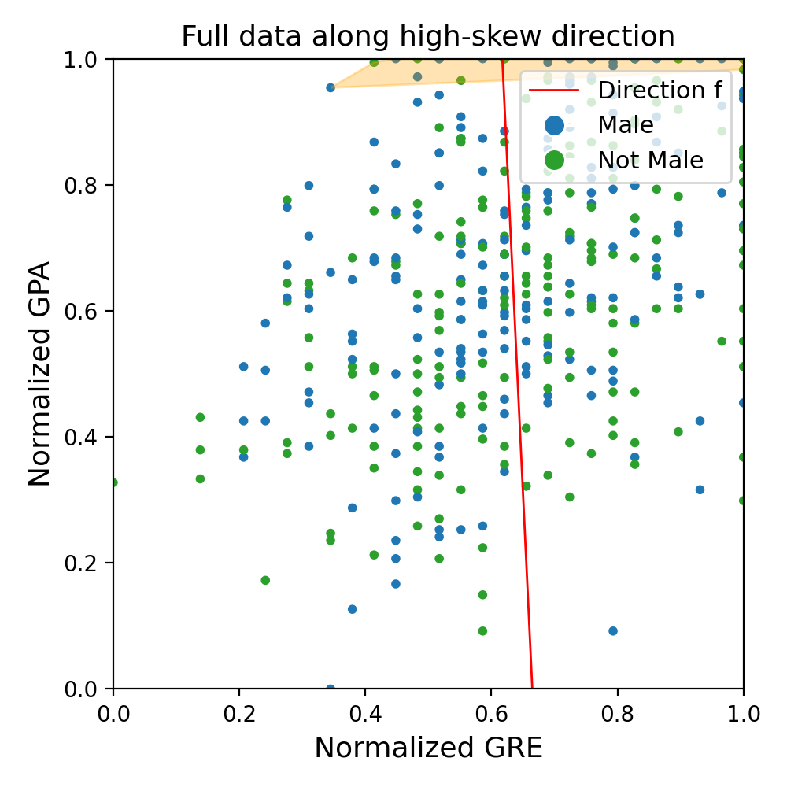
Tail subset shape (q=0.1): (40, 7)

=== Global vs Tail statistics (College Admission) ===
| Metric                             | Global | Tail |
|------------------------------------|:------:|:----:|
| Positive rate (admit=1)           | 0.318 | 0.475 |
| Accuracy (Logistic Regression)    | 0.713 | 0.625 |
| F1 (Logistic Regression)          | 0.320 | 0.516 |

=== Multi-Percentile Evaluation Table ===
| Percentile | Accuracy | F1-score | F/M ratio |
|-----------:|---------:|---------:|----------:|
|       1.00 |    0.712 |    0.320 |    1.111 |
|       0.50 |    0.650 |    0.397 |    1.105 |
|       0.20 |    0.658 |    0.471 |    1.079 |
|       0.10 |    0.625 |    0.516 |    1.000 |
|       0.08 |    0.688 |    0.615 |    0.778 |
|       0.04 |    0.733 |    0.600 |    0.875 |
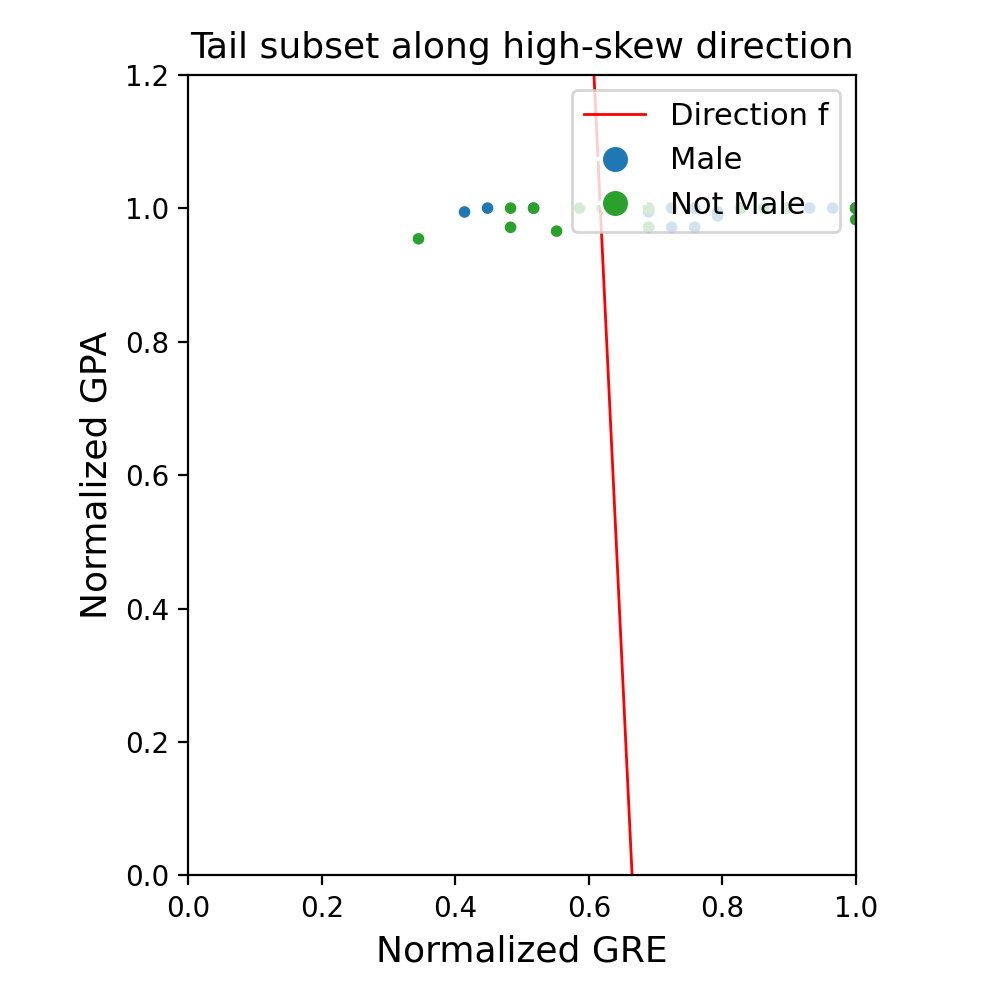
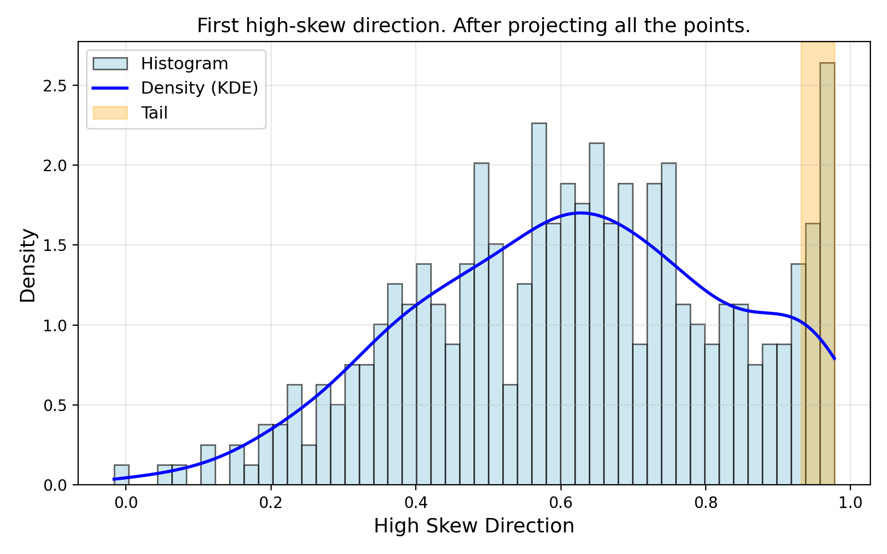

[Original] Visualizing tail along top-3 direction...

Using reimplemented top direction for visualization.

Validation: skew along chosen direction f is -0.012548
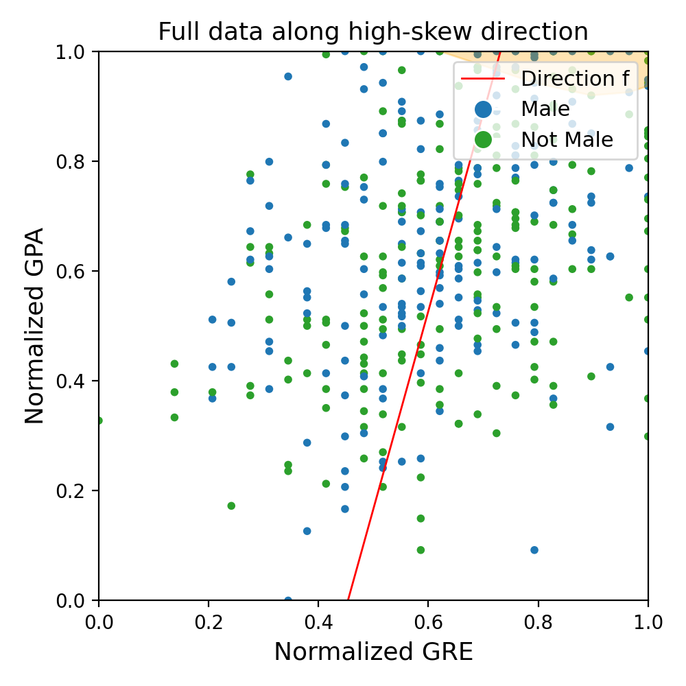
Tail subset shape (q=0.1): (40, 7)

=== Global vs Tail statistics (College Admission) ===
| Metric                             | Global | Tail |
|------------------------------------|:------:|:----:|
| Positive rate (admit=1)           | 0.318 | 0.400 |
| Accuracy (Logistic Regression)    | 0.713 | 0.575 |
| F1 (Logistic Regression)          | 0.320 | 0.452 |

=== Multi-Percentile Evaluation Table ===
| Percentile | Accuracy | F1-score | F/M ratio |
|-----------:|---------:|---------:|----------:|
|       1.00 |    0.712 |    0.320 |    1.111 |
|       0.50 |    0.640 |    0.400 |    1.174 |
|       0.20 |    0.650 |    0.481 |    0.951 |
|       0.10 |    0.575 |    0.452 |    0.739 |
|       0.08 |    0.625 |    0.538 |    0.684 |
|       0.04 |    0.625 |    0.625 |    1.000 |
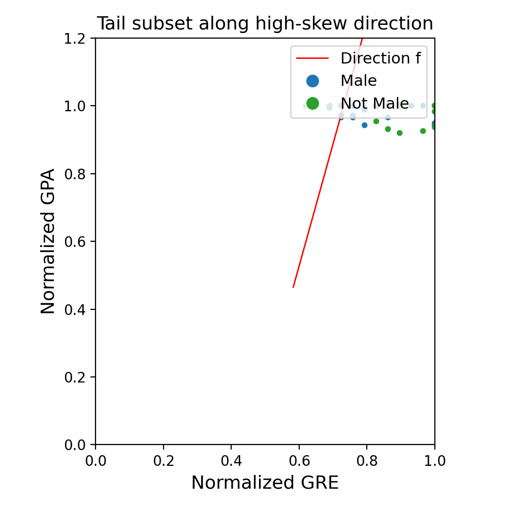
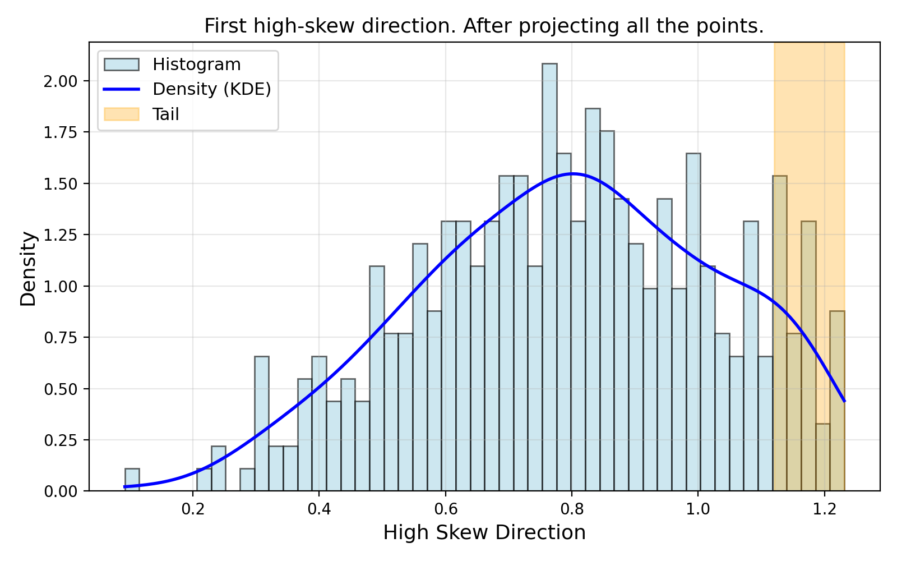

Visualizing top-3 directions for UPDATED VERSION (on primary set)...

[Updated] Visualizing tail along top-1 direction...

Using reimplemented top direction for visualization.

Validation: skew along chosen direction f is -0.005305
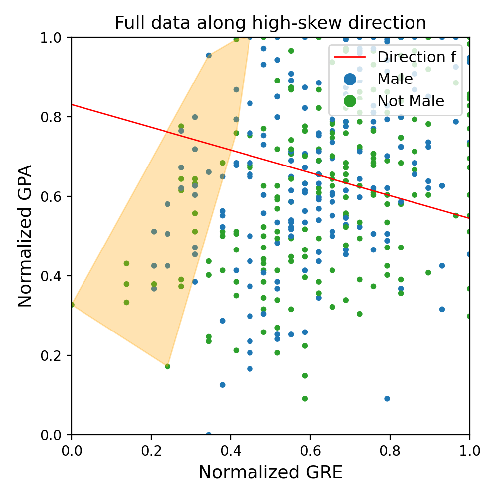
Tail subset shape (q=0.1): (40, 7)

=== Global vs Tail statistics (College Admission) ===
| Metric                             | Global | Tail |
|------------------------------------|:------:|:----:|
| Positive rate (admit=1)           | 0.318 | 0.225 |
| Accuracy (Logistic Regression)    | 0.713 | 0.775 |
| F1 (Logistic Regression)          | 0.320 | 0.000 |

=== Multi-Percentile Evaluation Table ===
| Percentile | Accuracy | F1-score | F/M ratio |
|-----------:|---------:|---------:|----------:|
|       1.00 |    0.712 |    0.320 |    1.100 |
|       0.50 |    0.765 |    0.254 |    1.247 |
|       0.20 |    0.775 |    0.250 |    1.105 |
|       0.10 |    0.775 |    0.000 |    1.222 |
|       0.08 |    0.844 |    0.000 |    1.133 |
|       0.04 |    0.875 |    0.000 |    1.000 |
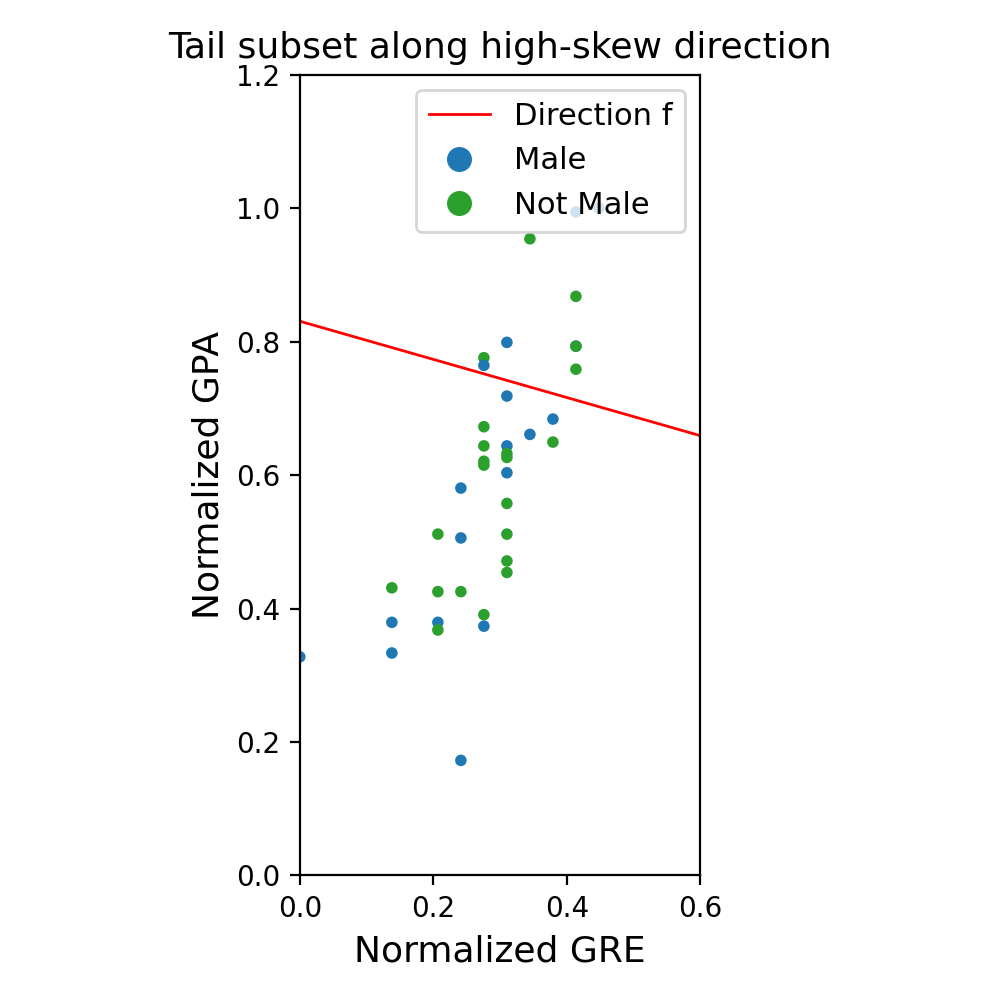
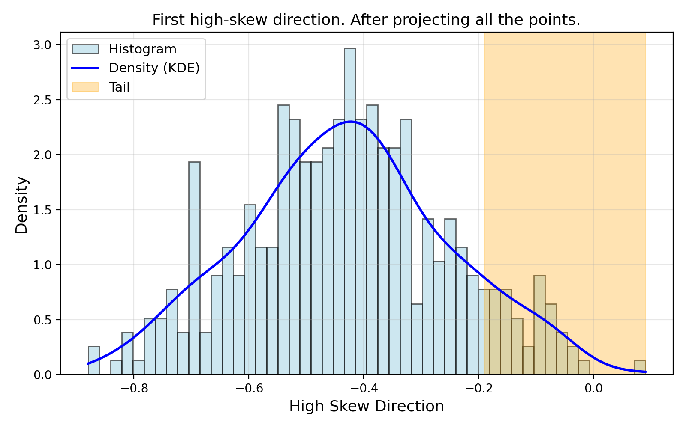

[Updated] Visualizing tail along top-2 direction...

Using reimplemented top direction for visualization.

Validation: skew along chosen direction f is -0.049722
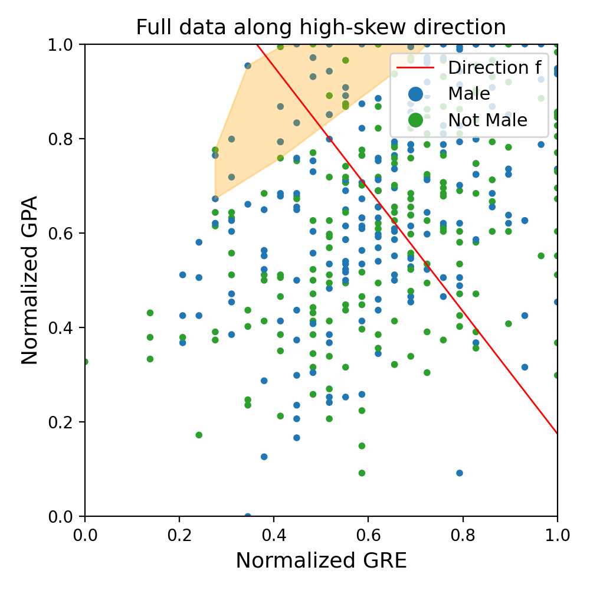
Tail subset shape (q=0.1): (39, 7)

=== Global vs Tail statistics (College Admission) ===
| Metric                             | Global | Tail |
|------------------------------------|:------:|:----:|
| Positive rate (admit=1)           | 0.318 | 0.436 |
| Accuracy (Logistic Regression)    | 0.713 | 0.641 |
| F1 (Logistic Regression)          | 0.320 | 0.364 |

=== Multi-Percentile Evaluation Table ===
| Percentile | Accuracy | F1-score | F/M ratio |
|-----------:|---------:|---------:|----------:|
|       1.00 |    0.714 |    0.321 |    1.111 |
|       0.50 |    0.695 |    0.371 |    1.128 |
|       0.20 |    0.675 |    0.409 |    0.818 |
|       0.10 |    0.641 |    0.364 |    2.000 |
|       0.08 |    0.677 |    0.444 |    1.818 |
|       0.04 |    0.800 |    0.400 |    1.500 |
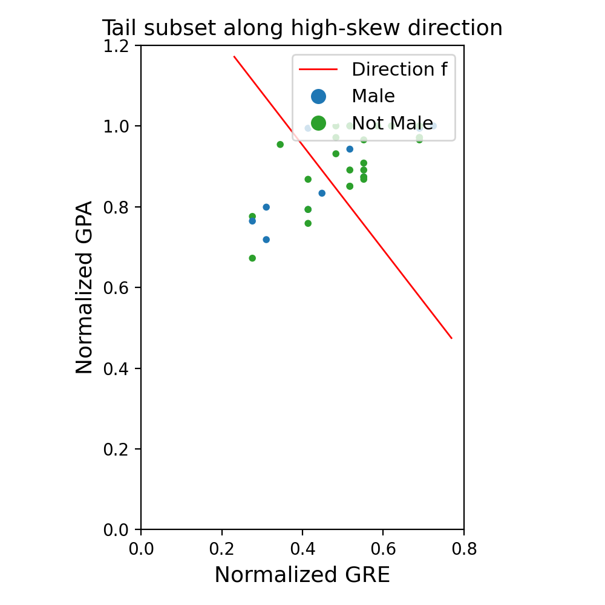
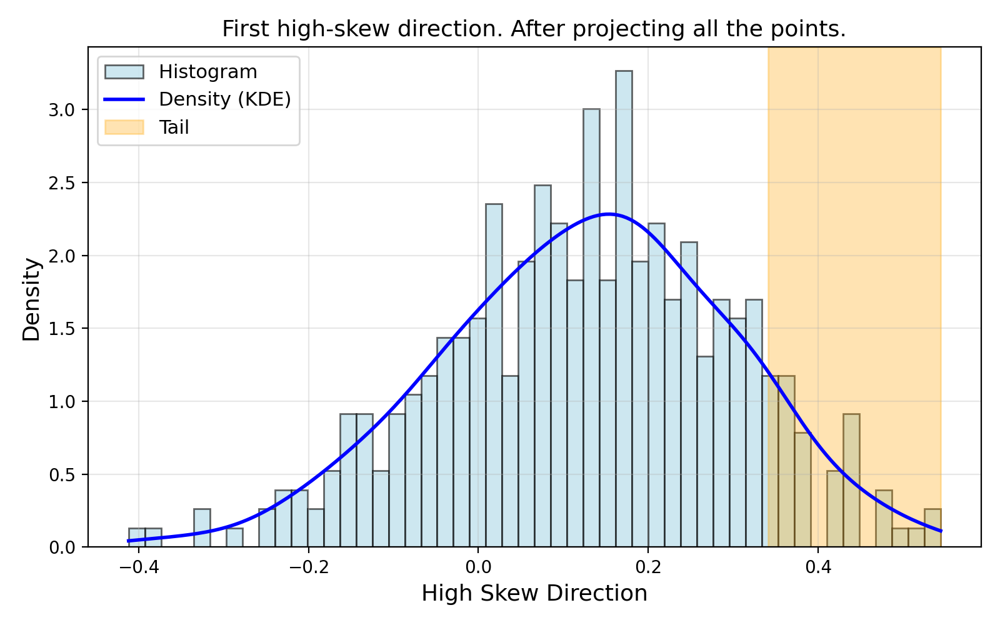

[Updated] Visualizing tail along top-3 direction...

Using reimplemented top direction for visualization.

Validation: skew along chosen direction f is -0.008176
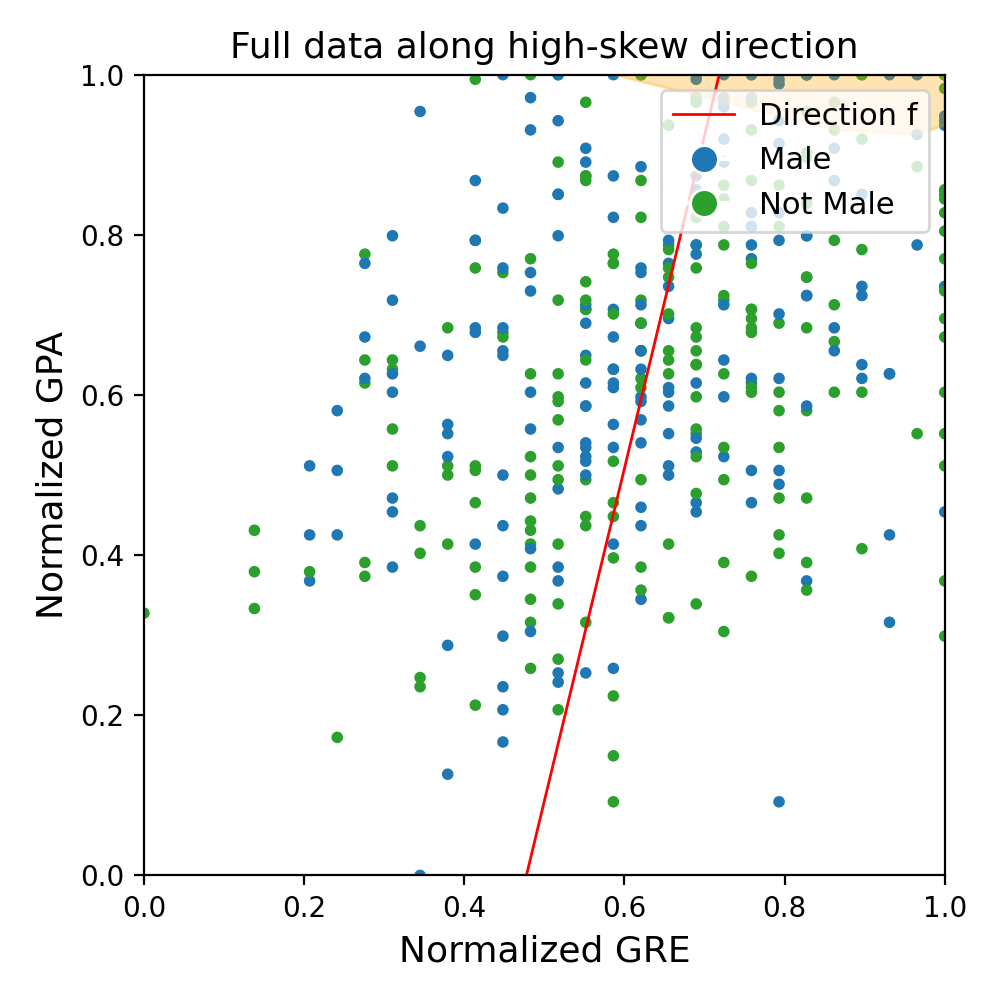
Tail subset shape (q=0.1): (39, 7)

=== Global vs Tail statistics (College Admission) ===
| Metric                             | Global | Tail |
|------------------------------------|:------:|:----:|
| Positive rate (admit=1)           | 0.318 | 0.385 |
| Accuracy (Logistic Regression)    | 0.713 | 0.615 |
| F1 (Logistic Regression)          | 0.320 | 0.483 |

=== Multi-Percentile Evaluation Table ===
| Percentile | Accuracy | F1-score | F/M ratio |
|-----------:|---------:|---------:|----------:|
|       1.00 |    0.712 |    0.320 |    1.111 |
|       0.50 |    0.648 |    0.397 |    1.187 |
|       0.20 |    0.662 |    0.509 |    1.000 |
|       0.10 |    0.615 |    0.483 |    0.773 |
|       0.08 |    0.613 |    0.538 |    0.722 |
|       0.04 |    0.625 |    0.625 |    1.000 |
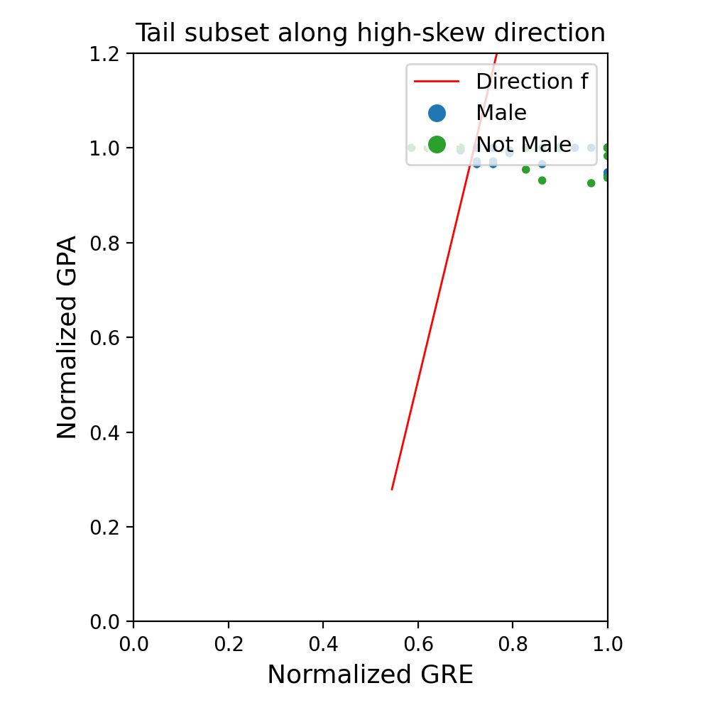
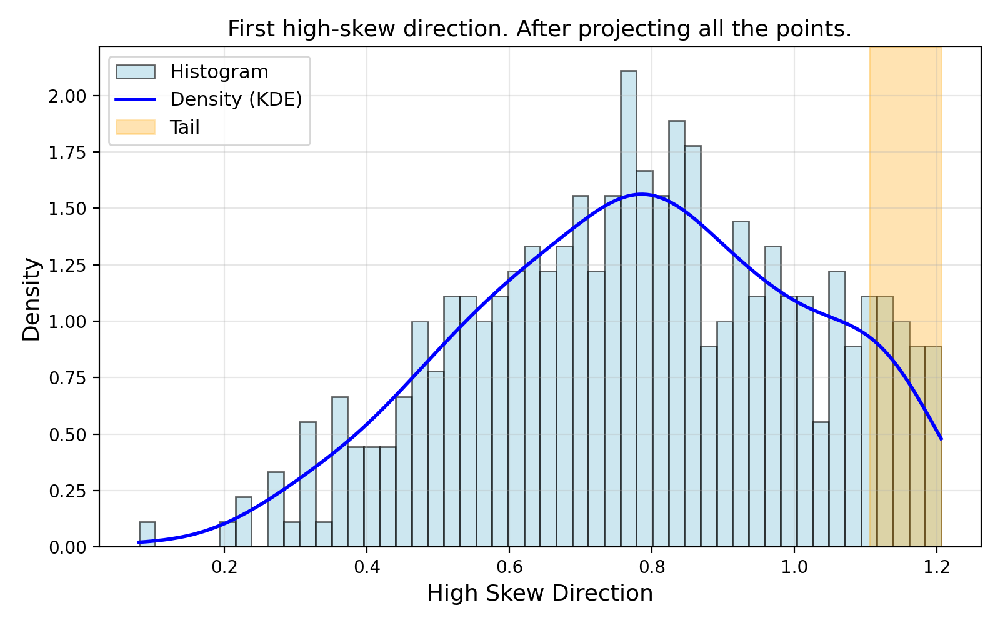
